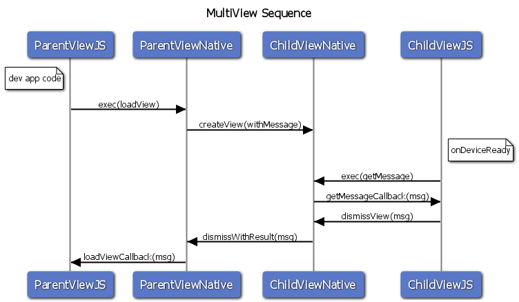

# Deprecated
This repo is no longer under active development and has been archived.
If you are still interested in using/forking/contributing to this plugin, please do so at it's new home :
https://github.com/purplecabbage/phonegap-plugin-multiview

---


# phonegap-plugin-multiview

This plugin allows your PhoneGap app to create multiple views.

[](https://travis-ci.org/phonegap/phonegap-plugin-multiview )

## Please check out a demo video which illustrates the passing of data between webviews:

[Android Demo](https://youtu.be/_ZzBA28QO4s "Youtube -Android Demo Movie")

[iOS Demo](https://youtu.be/WVbxFIGBh0Y "Youtube -iOS Demo Movie")

Each View:
- has it's own global context
- has it's own collection of plugins (instances, classes are shared, so watch for statics )
- can communicate via localStorage ( assuming they are loaded from the same location )
- has access to all Cordova resources

### Currently Supported Platforms:
- iOS
- Android

### This Repo Includes a Brief Demo Project, to Run it in iOS/Android:

```bash
$ cd demo
$ cordova platform add iOS (or) cordova platform add android
$ cordova plugin add --link .. (Android does not link)
$ cordova run iOS (or) cordova run android
```

The Demo application illustrates the passing of data between a parent-view and child-view, however the API provides support for 
*multiple* views in a stack.  Each additional view must have it's own JavaScript file that corresponds with native portions of the plugin.

## Installation Instructions

    // fork, clone and install from you local repo, or 
    // install it from npm, using phonegap cli
    phonegap plugin add phonegap-plugin-multiview
    
    // or cordova cli
    cordova plugin add phonegap-plugin-multiview

## Quickstart Guide to Using the MultiView Plugin

### To launch a new webview make this call in your application's JavaScript:
      PGMultiView.loadView(url, strPayload, success, error);

- **url**        : the location of your html file, relative or absolute.
- **strPayload** : string data to pass to the secondary view (protip: use JSON.stringify & JSON.parse to pass objects) 
- **success**    : function to call on success
- **error**      : function to call on error

Each view/page will typically have it's own js files, even though each view/page can access the same cordova.js and plugin collection.

### To *dismiss* a webview make this call in your application's JS:
    // this is a call that is run in the secondary view/page
    PGMultiView.dismissView(strPayload);      
           
- **strPayload**, a string to pass back to the parent view. (protip: use JSON, as above)

### An example callback success function:

```javascript
function onMultiviewSuccess(strPayload) {
    var obj = JSON.parse(strPayload);
    if(obj.someExpectedProperty == 'some expected value') {
        // do you always do what's expected of you?
    }
}
```
### Sequence of events ( a peek under the hood )


### Known Issues
On Android each view is implemented as a separate activity.  Under low memory situations, the parent view might be discarded while presenting the second view.  In this situation state will be lost and the result cannot be properly routed back to the success callback when the second view is dismissed.

pull requests welcome!
